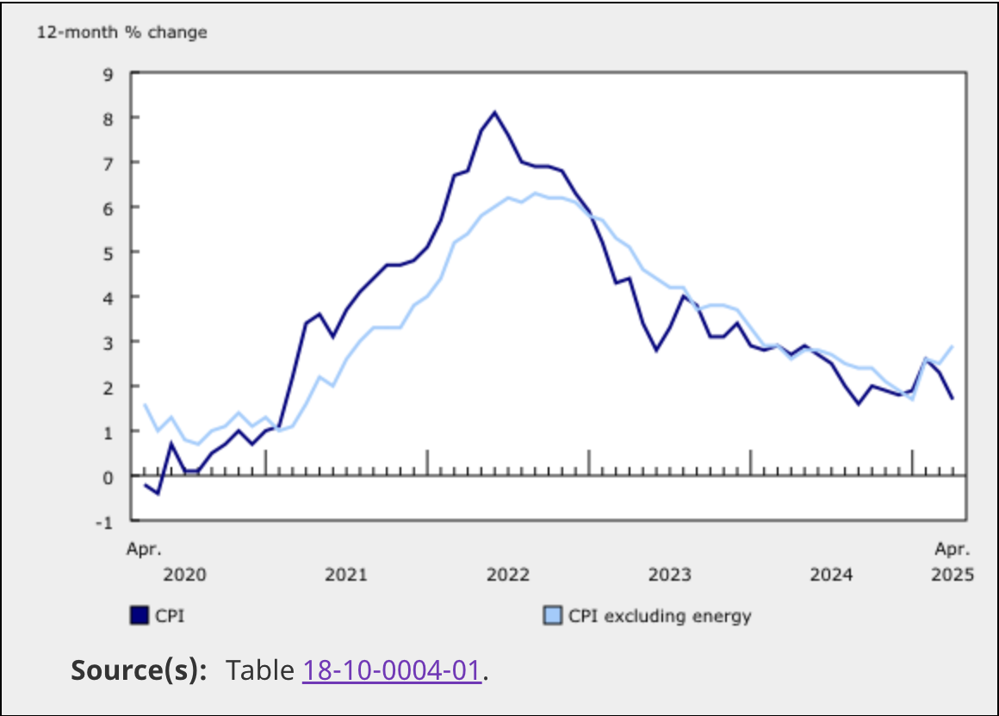

Citing Sources from Statistics Canada
======================================

When including data, charts, or figures from Statistics Canada in your reports or presentations, it’s important to properly cite the source to ensure transparency and academic integrity.

How to Cite Data from Statistics Canada
---------------------------------------

Suppose you include a chart like the one below, showing the 12-month percentage change in the Consumer Price Index (CPI) and CPI excluding energy from April 2020 to April 2025. You should include the data source directly below the chart.

Make the table name a clickable link to the original Statistics Canada dataset.
The source should be formatted as:

   Source(s): Table [table_name]

For example:

   Source(s): `Table 18-10-0004-01 <https://www150.statcan.gc.ca/n1/daily-quotidien/250520/cg-a001-eng.htm>`__

