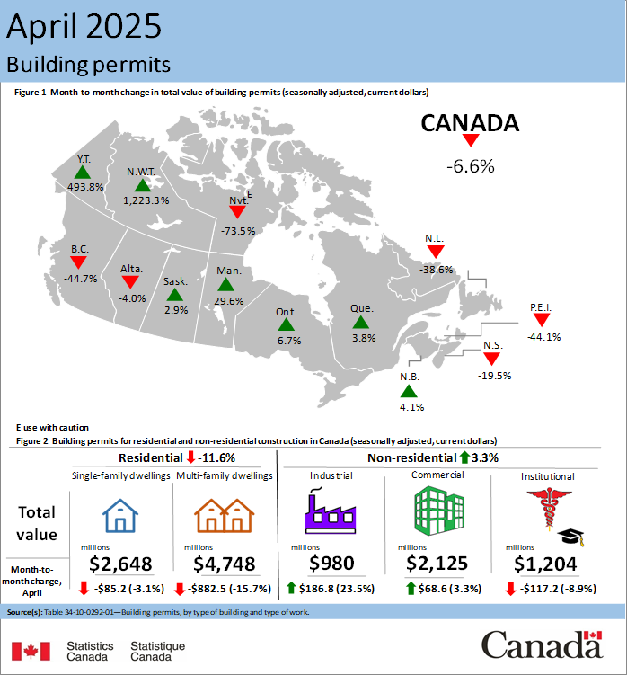

Data Visualization Tips
========================

Time Series Clarity
-------------------
- Display dates/time frames on the x-axis in ascending order (unless there’s a specific reason not to). This ensures intuitive trend interpretation

Label Everything
----------------
- Always label axes and include units (e.g., "Percentage (%)" or "Population (thousands)").
- Define variables and terms in captions or legends (e.g., clarify if "46.0" represents people, percentages, or scaled values).

Title & Context
---------------
- Use clear, descriptive titles that specify the metric (e.g., "Mean Household Income (2020–2024)" instead of "Income Trends").
- Indicate whether values are sums, means, medians, etc. (e.g., "Median Wait Times for Emergency Care").

Plot Type Selection
-------------------
- Line charts: Trends over time
- Bar charts: Category comparisons
- Boxplots/Violin plots: Distributions

Design Best Practices
---------------------
- Use consistent colors/legends across plots to aid comparison.
- Annotate key trends (e.g., "Peak in 2021" with an arrow).
- Avoid clutter: Split complex data into multiple plots.

Avoid Misleading Scales
-----------------------
- Start y-axis at zero unless justified (e.g., log scales). If truncated, explain why in the caption.

Accessibility
-------------
- Ensure color choices are colorblind-friendly (tools: ColorBrewer).
- Use patterns/textures in addition to colors for B&W printing.

Normalization for Comparisons
-----------------------------
- Normalization removes scale differences, letting viewers focus on relative changes.
- When to normalize: 
    - If the main goal is to compare trends or patterns (not absolute values), scale values to a common range (e.g., 0–1 or 0–100%).
- How to label:
    - Clearly state the normalization method in the axis/caption (e.g., *"Values normalized to 2015 baseline (=100%)"* or "Percent of total group").
- Caveats:
    - Avoid normalization if absolute values matter (e.g., budget allocations in dollars).

Examples
----------------
**Infographic: Building Permits in Canada**

It's important to include clear elements such as a title, map, explanation, and tables or summary boxes. These elements help ensure your message is easy to understand at a glance.
The infographic below summarizes building permits in Canada for April 2025:

Notice how it uses a combination of:

- Title: Clearly states the topic and time period.
- Map: Visualizes geographic differences across provinces and territories.
- Explanations: Uses color, arrows, and percentages to highlight changes.
- Tables/Summaries: Breaks down the data into categories (residential, non-residential) and uses icons for quick interpretation.
- Source: Properly cites the data source at the bottom.
